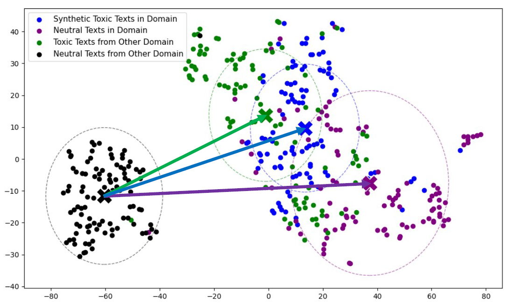

# ToxiGAN: Toxic Data Augmentation via LLM-Guided Directional Adversarial Generation

## Overall Framework of ToxiGAN
ToxiGAN with k toxic generators, one neutral texts provider, and one multi-class discriminator:
- Toxic Generator Module ($G$): Consists of multiple LSTM-based toxic generators and learns to generate samples for each toxic class from a noise distribution. Each class has a dedicated decoding branch.
- Multi-class Discriminator ($D$): Classifies input text into $K+2$ classes: $K$ toxic classes, one neutral class, and one fake class to capture unrealistic generations.
- LLM-based Neutral Text Provider: A pre-trained LLM (e.g., Llama 3.2) is used to generate neutral in-domain examples for training $D$ and guiding $G$ via few-shot learning from the real neutral texts.


## Illustration of Two-Step Alternating Directional Learning in Embedding Space
The black arrow shows the initial generation after pretraining. Gray arrows represent updates during alternating optimization: shifting toward toxicity and authenticity directions by penalizing unexpected directional evaluations.


t-SNE visualization of real and synthetic texts. Arrows indicate semantic shifts: neutral to toxic (green), out-of-domain to in-domain (purple), and their composite (blue).



## Run ToxiGAN
Direct to [ToxiGAN/](ToxiGAN/): Run train.py for training ToxiGAN. 
```
python ToxiGAN/train.py 
```
