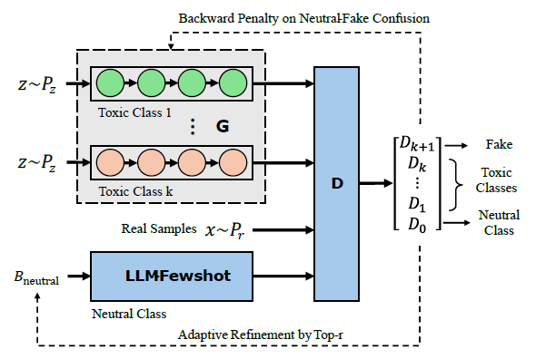
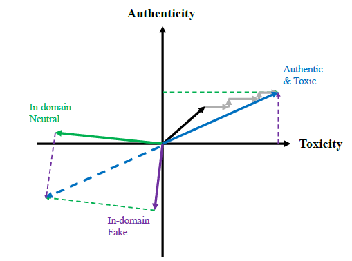

# ToxiGAN: Toxic Data Augmentation via LLM-Guided Directional Adversarial Generation

The paper has been accepted to the main conference of EACL 2026, and can be viewed [here](https://arxiv.org/abs/2601.03121).

## Purpose and Research Motivation
ToxiGAN is developed solely for **data augmentation in toxicity classification**, to address data imbalance and improve model robustness. Generated texts are used only for **controlled classifier training and evaluation**, not for human-facing applications.

> [!WARNING]
> ## Dual-Use & Harmful Content Warning
> This repository contains research code for *toxic/hate speech style text generation* used for data augmentation and robustness studies.
> It is **dual-use** and can be misused to create or amplify hateful, harassing, or discriminatory content.
>
> **Do not use this project to generate, disseminate, or target individuals or protected groups with harmful content.**
> Use only for legitimate research and safety purposes (e.g., toxicity detection, mitigation, robustness evaluation), and comply with applicable laws, platform policies, and data governance requirements.
>
> By using this repository, you agree to handle outputs responsibly (access control, filtering, logging where appropriate) and avoid releasing raw generated toxic content.

## Overall Framework of ToxiGAN
ToxiGAN with k toxic generators, one neutral texts provider, and one multi-class discriminator:
- Toxic Generator Module ($G$): Consists of multiple LSTM-based toxic generators and learns to generate samples for each toxic class from a noise distribution. Each class has a dedicated decoding branch.
- Multi-class Discriminator ($D$): Classifies input text into $K+2$ classes: $K$ toxic classes, one neutral class, and one fake class to capture unrealistic generations.
- LLM-based Neutral Text Provider: A pre-trained LLM (e.g., Llama 3.2) is used to generate neutral in-domain examples for training $D$ and guiding $G$ via few-shot learning from the real neutral texts.



## Two-Step Alternating Directional Learning in Embedding Space
The black arrow shows the initial generation after pretraining. Gray arrows represent updates during alternating optimization: shifting toward toxicity and authenticity directions by penalizing unexpected directional evaluations.




## To Start
Requirements
- PyTorch 2.6.0 + CUDA/cuDNN backend
- transformers==4.53.3
- sentence-transformers==4.1.0
- scikit-learn==1.6.1

Direct to [ToxiGAN/codes/](codes/): Run train.py for training of ToxiGAN. 
```
$ python train.py 
```
After training of ToxiGAN, generate samples by the following command.
```
$ python generate_samples.py 
```

## Citation
To cite this work, please use the following:
```
@inproceedings{
    li2026toxigan,
    title={Toxi{GAN}: Toxic Data Augmentation via {LLM}-Guided Directional Adversarial Generation},
    author={Peiran Li and Jan Fillies and Adrian Paschke},
    booktitle={19th Conference of the European Chapter of the Association for Computational Linguistics},
    year={2026},
    url={https://openreview.net/forum?id=l8RRGe8okJ}
}
```
